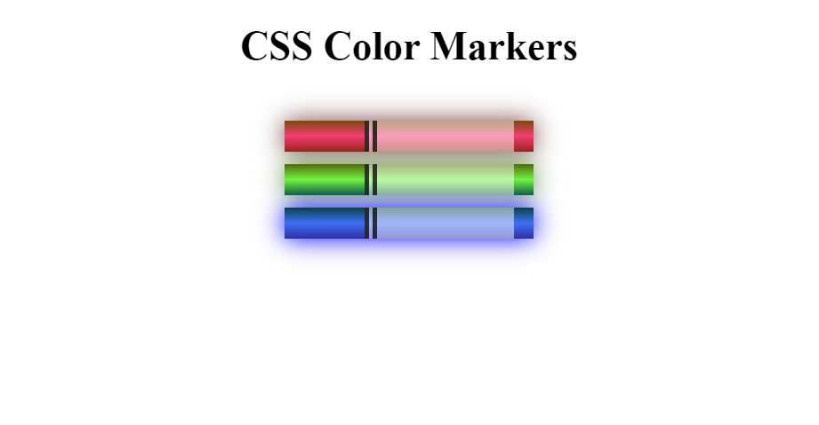

# Colored Markers

This project demonstrates a simple HTML and CSS setup to display colored markers. Each marker is styled with different colors using CSS.

## Prerequisites

- A web browser to view the HTML file.

## Setup

1. Clone the repository or download the files.
2. Open the `index.html` file in your web browser.

## Screenshot

## Files

- `index.html`: The main HTML file.
- `styles.css`: The CSS file for styling the markers.

## Usage

Open the `index.html` file in your browser to see the colored markers.

## License

This project is licensed under the MIT License.